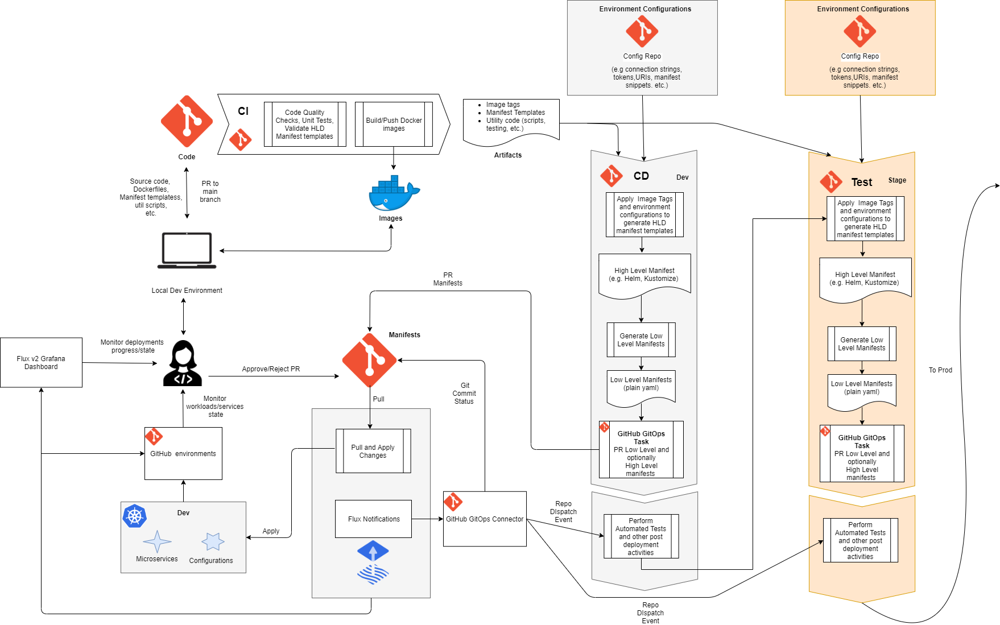

# GitOps with GitHub and Flux v2

The diagram above describes in details a CI/CD process built with GitHub and Flux v2

It targets to resolve the following challenges:

- The manifests repository shows what happens with the applications in the K8s clusters. However, it only shows the desired state and very often the current state. But things can go wrong, labels can be misplaced, and the image can be unavailable, even though the manifests were successfully applied.
- To build a multistage CD workflow, there must be a backward connection from Flux v2 to GitHub that reports the deployment state/result. This backward connection allows the CD workflow to proceed with testing, notifying, deploying to the next environment, etc. There should be a guidance implementation of such a backward connection so that GitHub agents are not blocked waiting for Flux v2 to finish the deployment.
- To approve deployment to an environment, an approver should use two systems: GitHub/Flux v2 to see what has actually changed and GitHub to approve/reject, which is confusing and inconvenient. The goal is to integrate GitHub with Flux v2 to have a single point to perform at least basic deployment activities so that we can see/control the entire CD process from GitHub.

The developers write their code and debug and test it both locally and on the Dev environment. The Code git repository stores the code, which contains the application source code and descriptors describing how to build, deploy and run the application on a K8s cluster. Those descriptors are the Docker files and manifest templates. The manifest templates can be developed with a high-level definition templating tool such as Jsonnet, Helm, Kustomize, etc. It can be a combination of them, or it can be just plain K8s yamls with placeholders for configuration variables and image tags. Besides that, the code repository normally contains PR/CI/CD workflow definitions and utility code.  

Once either of the code components (src, Dockerfiles, manifests, etc.) is pushed to a collaboration (main) branch, a CI workflow takes care of that and produces artifacts. It runs code quality checks and unit tests, validates manifest templates, and builds and pushes Docker images (only if the corresponding code base has changed!). The artifacts of the CI workflow are a list of built image tags, validated manifest templates (e.g. jsonnet files), and utility code that might be used by the subsequent CD workflow.

The CD workflow, which is triggered automatically right after the CI workflow, consumes these artifacts. It delivers in a multistage way K8s manifests that must be deployed for each environment, and it promotes the artifacts to the next environment only after successful deployment on the previous one. The CD workflow contains a function of manifest templates, image tags, sets of variable values (for each environment), and it returns/produces K8s manifests for each environment. The configuration variables for each environment might be stored in GitHub secrets (separated by environments) or/and in order to strictly follow the GitOps doctrine they might be stored in a Configuration git repositories (separated by branches/folders for each environment). These configurations normally contain connection strings, ports, URIs, etc. They may even contain manifest template snippets that differ from environment to environment and that are applied on top of generic manifest templates from the code repo.

The CD workflow takes the artifact manifest templates and processes them by applying image tags and environment configurations. As a result, it produces high-level definition manifests (assuming the code contains HLD manifest templates) that are ready to be applied to the environment. For example, the code repo may contain jsonnet templates and this step produces Helm+Kustomize manifests. These manifests might be fed directly to Flux v2, however it is beneficial (and considered as the best practice) to generate the low-level K8s yaml manifests in the CD pipeline and feed them to Flux v2. It gives better control on the manifests generation approach, visibility for the approver on what manifests are actually going to be applied, and eliminates dependency on the specific GitOps operator implementation. The CD workflow PRs the generated low-level manifests to the Manifests repository, which is observed by Flux v2. Optionally, in addition to low-level manifests, it also PRs in a separate folder high-level manifests, which may give better visibility on the changes for the use cases with tons of long low-level manifests, which is difficult for a human to review. Once the PR is issued, the CD workflow completes.

Once the PR is approved/merged, Flux v2 pulls the changes from the Manifest repo and applies them to the environment. During the synchronization, Flux v2 notifies on every phase change and every health check change an integration component "GitHub GitOps Connector". This component "knows" how to communicate to GitHub, and it updates the Git commit status, which makes the synchronization progress visible in the repo. When the synchronization, including a health check, has successfully finished, the connector triggers a repository dispatch webhook event in the GitHub code repository. If the synchronization fails, the Git commit status will be updated and the whole CD workflow will not continue.

The repository dispatch webhook event triggers another CD workflow run, which performs automated tests and all the necessary post-deployment activities. Once this is completed, it moves to the next stage.
