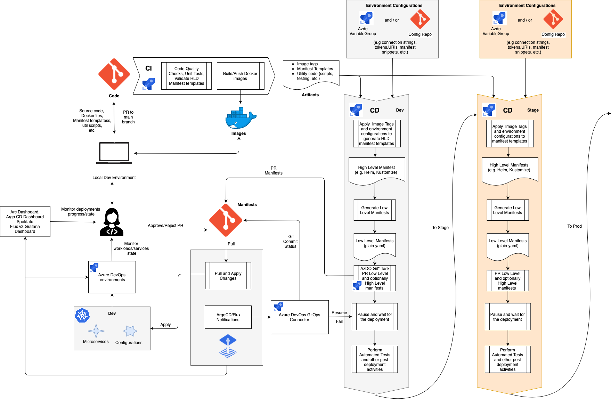

# GitOps with Azure DevOps and Flux

The diagram above describes in details a CI/CD process built with Azure DevOps and Flux

<i>
It targets to resolve the following challenges:

- The manifests repository shows what happens with the applications in the K8s clusters. However, it only shows the desired state and very often the current state. But things can go wrong, labels can be misplaced and image not being able to be pulled, even though it was successful to apply the manifests.
- To build a multistage CD pipeline there must be a backward connection from Flux to Azure DevOps that reports the deployment state/result so the CD pipeline can proceed with testing, notifying, deploying to next environment, etc. There should be a guidance/implementation of such connection in a proper way so the Azure DevOps agents are not blocked waiting for Flux to finish the deployment.
- In order to approve deployment to an environment an approver should use two systems Flux to see what has actually changed and Azure DevOps to approve/reject. This is confusing and inconvenient, so the desire is to integrate Azure DevOps with Flux to have a single point to perform at least basic deployment activities, so that we can see/control the entire CD process from Azure DevOps.
</i>

The developers write their code and debug and test it both locally and on dev environment. The code is stored in the Code git repository and contains the application source code and descriptors describing how to build, deploy and run the application on a K8s cluster. Those descriptors are the Docker files and manifest templates. The manifest templates can be developed with a high level definition templating tool such as Jsonnet, Helm, Kustomize, etc., it can be a combination of them or it can be just plain K8s yamls with placeholders for configuration variables and image tags. Besides that the code repo normally contains PR/CI/CD pipeline definitions and utility code.  

Once either of the code components (src, Dockerfiles, manifests, etc.) is pushed to a collaboration (main) branch, a CI pipeline takes care of that and produces artifacts. It runs code quality checks, unit test, validate manifest templates, builds and pushes Docker images (only if the corresponding code base has changed!). The artifacts of the CI pipeline are a list of built image tags, validated manifest templates (e.g. jsonnet files) and utility code that might me used by the following CD pipeline.

These artifacts are consumed by the CD pipeline which is triggered automatically right after the CI pipeline. The CD pipeline delivers in a multistage way K8s manifests that must be deployed for each environment and it promotes the artifacts to the next environment only after successful deployment on the previous one. The CD pipeline basically contains a function of manifest templates, image tags, sets of variable values (for each environment) and it returns/produces K8s manifests for each environment. The configuration variables for each environment might be stored in Azure DevOps variable groups (separated by environments) or/and in order to strictly follow the GitOps doctrine they might be stored in a Configuration git repositories (separated by branches/folders for each environment). These configurations normally contain connection strings, ports, URIs, etc., they may even contain manifest template snippets that differ from environment to environment and that are applied on top of generic manifest templates from the code repo.

The CD pipeline takes the artifact manifest templates and processes them by applying image tags and environment configurations. As the result it produces high level definition manifests (assuming the code contains HLD manifest templates) that are ready to be applied to the environment. For example, the code repo may contain jsonnet templates and this step produces Helm+Kustomize manifests. Actually, these manifests might be fed directly to Flux, however it is beneficial (and considered as the best practice) to generate the low level K8s yaml manifests in the CD pipeline and feed them to Flux. It gives better control on the manifests generation approach, visibility for the approver on what manifests are actually going to be applied and eliminates dependency on the specific GitOps operator implementation. The CD pipeline PRs the generated low level manifests to the Manifests repository which is observed by Flux. Optionally, in addition to low level manifests, it also PRs in a separate folder high level manifests which may give better visibility on the changes for the use cases with tons of long low level manifests which is difficult for a human to review. Once the PR is issued the CD pipeline is paused in agentless mode waiting for the result.

Once the PR is approved/merged, Flux pulls the changes from the Manifest repo and applies them to the environment. During the synchronization Flux notifies on every phase change and every health check change an integration component "Azure DevOps GitOps Connector". This component "knows" how to communicate to Azure DevOps and it updates the Git commit status so the synchronization progress is visible in the repo. When the synchronization including health check has successfully finished or failed the connector resumes or fails the CD pipeline respectively.

If Azure DevOps environment is configured with a K8s namespace it gives information on the state of the K8s services and workloads including yaml specifications and pod logs. See [Environment - Kubernetes resource](https://docs.microsoft.com/azure/devops/pipelines/process/environments-kubernetes?view=azure-devops) for the details. It can be used as an additional observability instrument that gives a descent level of insight right in the Azure DevOps UI.

Once the CD pipeline is signaled that the deployment was successful it performs automated tests and all the necessary post deployment activities. Having done that, it moves to the next stage.
