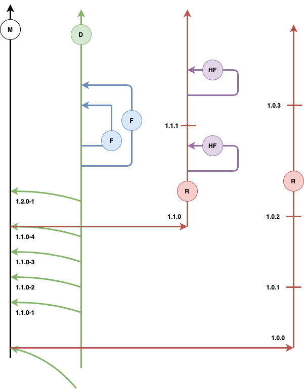
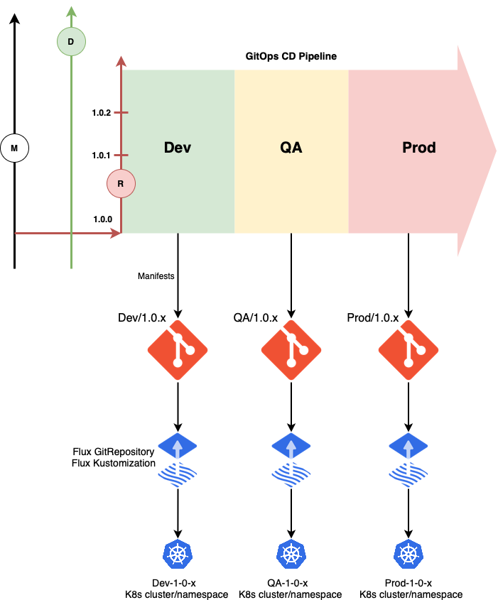

# Branching strategy in GitOps environment

## Use Case
There is an organization “KaizenSoft” producing a cloud native application “KubeKaizen” consisting of multiple microservices. According to their release policy they release a new version of KubeKaizen every month. The released version includes a number of new features and bugfixes. According to their support policy they support two latest released versions. That means they keep publishing weekly hotfixes for those versions. The hotfixes, normally, contain bug fixes only without any new feature, so the customers can install them safely. 

KubeKaizen is a cloud native application, so KaizenSoft leverages GitOps as a primary approach in their continuous delivery process.

The challenge is to organize properly source and manifests Git repositories to handle SDLC of multiple KubeKaizen versions simultaneously.

## Source Branching Strategy

The diagram below describes a common branching layout in the source Git repository to support both new feature development for the future release and bug fixes for the released versions. This approach aligns with the [source code branching strategy](https://docs.microsoft.com/azure/devops/repos/git/git-branching-guidance?view=azure-devops#why-not-use-tags-for-releases) used at Microsoft to [manage releases](https://docs.microsoft.com/en-us/azure/devops/repos/git/git-branching-guidance?view=azure-devops#manage-releases) of the Azure online services.

 

There is a collaboration (Dev) branch “D” to which developers PR feature branches. At the end of each sprint the Dev branch is merged into Main. The Main branch serves as a major timeline, always containing a working and tested version from the last sprint. After each 4 development sprints a new version is released. The released code is sub-branched in a Release branch (some teams perform the releasing through a temporary “stabilizing” pre-release branch for the “polishing” activities). A release branch separates the released code and allows to issue periodic hot fixes without introducing the "new feature" code to the version where it's not supposed to be, so the version remains stable.

KaizenSoft released and supports two KubeKaizen versions 1.0.x and 1.1.x. Developers PR HotFix (HF) branches into the Release branches to fix bugs. As new features are implemented, the code base in Dev may differ from the Release branches significantly. The release branches never get merged back to Dev or main. In general case, to fix the same bug in the Dev branch (if it still exists in Dev code) it’s needed to PR a separate Feature branch with the fix to the Dev branch. Pretty often, though, the bug fix commit can be cherry-picked from the HF to Feature branch. Periodically, KaizenSoft publishes a HotFix version with a number of bug fixes (e.g. 1.0.1, 1.0.2, 1.1.1). After releasing KubeKaizen 1.1.0, the team started working on 1.2.0. 

Different microservices may be developed by different teams, may have different lifecycles and therefore different source repositories. Furthermore, they may have different releasing cadency, it's not necessarily to release all microservices together. There are various models of releasing applications decomposed in microservices.

Some recommend to synchronize releasing of microservices (even though the sprint cadency may be independent). Some models dictate to release an umbrella application version (e.g. KubeKaizen 1.1.0) which is a combination of independently released (but not published) microservices. In this case customers (e.g. 100s of them) don't install/update every single microservice (e.g. 100s of them) but install/update the whole package. It is guaranteed by the vendor that this combination of microservices versions (front-end-1.1.0 and back-end-1.0.0) which is called KubeKaizen 1.1.0 is tested and supported. Some release and publish microservices totally asynchronously so that either a Dev(Ops) team or a customer installs/updates every single microsorvice independently.  

Which model is right for you depends on two main factors: application architecture (how tightly microservices are coupled) and vendor-customer relationship. It is way beyond the scope and purpose of this article to recommend a microservices releasing model, but it suggests a branching strategy for the source code and manifests repository that works well for any chosen model.   

The following table gives the summary of the source branching layout for a single microservice (or a monolith):

|Branch|Description|Lifespan|Merging|Tags|
|-|-|-|-|-|
|Main (M)|Major timeline. Always contains a working and tested code from the last sprint.|Day 1 – Forever|Merged from Dev branch at the end of each sprint|On each release (e.g. v1.0.0, v1.1.0)|
|Dev (D)|The development collaboration branch. The main driver of progress. Contains stable code only at the end of each sprint.|Day 1 – Forever|Merged from Feature branches. Merged to Main branch.|At the end of each sprint|
|Feature (F)|A subbranch from Dev to implement a feature or to fix a bug |Created per user story/task/bug|Merged to Dev branch.|None|
|Release (R)|Supported released version. The code is always stable. No new features here.|Release Date – End of version support|Merged from HotFix branches|On each Hot Fix (e.g. v1.0.1, v1.1.1)
|HotFix (HF)|A subbranch from Release to fix a bug|Created per bug|Merged to Release branch|None|

Release branches live as long as a corresponding version is supported. Tags on source branches serve as milestone marks so they point events like releases, hot fixes and sprints to the exact commits in the source change history. With this approach you can get back to the code that was released years ago if you need it for some reason.   

## Manifests Branching Strategy

Through the development lifecycle, the source code in Dev and Release branches is continuously integrated and delivered to a chain of environments (e.g. Dev->QA->Prod). Like the source code, the environments for each alive version are also separated to support a proper development lifecycle. So 1.0.x, 1.1.x and 1.2.x (current) versions have their own instances of Dev->QA->Prod (like Dev_1.0.x->QA_1.0.x->Prod_1.0.x, etc.). Every version has a CI workflow/pipeline that continuously builds the code and a CD workflow/pipeline that delivers the build result in a GitOps fashion:

In GitOps methodology any environment is represented declaratively by manifests in a Git repository. This is a fundamental concept. So, every environment on the diagram above should have a place in the Git repository that reflects the environment. Continuous delivering in GitOps fashion is actually putting manifests to environment-specific places in the repository. These places are observed by a GitOps operator which applies the manifests to the environment performing the actual deployment. The common practice is to separate environments with branches and applications/microservices with folders. Having a separate branch (or repo) per environment addresses better security concerns, gives cleaner commit history and commit status, the PRs to different environments don’t interfere with each other. The most common ones are collected in the following table:

|Option|Example|Pros|Cons|
|-|-|-|-|
|1. Single manifest repo, different sets of branches (a branch per environment-version)|Repo: Manifests   Branches:  (Dev, QA, Prod), (Dev/1.0.x, QA/1.0.x, Prod/1.0.x), (Dev/1.1.x, QA/1.1.x, Prod/1.1.x)| - Simple   - Easy to maintain   - Easy to configure CD for new versions| - The branches are not grouped   - Single point of failure|
|2. A manifest repo per version, a branch per environment|Repos: Current, 1.0.x, 1.1.x   Branches: Dev, QA, Prod |Clean separation/visibility| - Overwhelming number of repos   - Pain to create/destroy repos on every new release   - Configuring CD for a new repo is more difficult|
|3. A repo per environment, a branch per version.|Repos: Dev, QA, Prod   Branches: Current, 1.0.x., 1.1.x| - Clean separation/visibility   - Secure   - Easy to configure CD for new versions|Overwhelming number of repos|
|4. A repo for non-prod environments (Dev, Qa, UAT, ...) and a repo for Prod, a branch per version.|Repos: Non-Prod, Prod   Branches: Current, 1.0.x., 1.1.x| - Clean separation/visibility   - Secure   - Easy to configure CD for new versions   - Only two manifests repos||

The recommendation of this article is option #4, which is a reasonable combination of options #1 and #3 when all environments but Prod live in a single repo. This option has all the benefits of #1 and addresses the security/vulnerability concern by separation Prod environment. This approach follows the same philosophy as the target environment separation, for example, when all environments before prod live on the same K8s cluster, and the prod one is completely separated. 

## CI/CD Pipelines

The CI/CD pipelines setup for different versions depends pretty much on the orchestrator. What is common, is that CD pipelines for different versions should operate with different configuration sets that represent environments for that version. In Azure Pipelines it can be achieved by using Variable Groups with specific names like CD_Dev_1.0.x, CD_QA_1.1.x, etc. In GitHub Actions this function is handled by Environment Secrets. 

## Tagging Manifests Repositories

It is helpful to have in a CD pipeline/workflow a step that creates an annotated tag in a Manifest repo branch with the reference to the commit in the source repo. It gives more traceability, so that the change in the manifests is connected to the original source change.

## Release automation
Releasing a new version includes performing a number of activities such as source code sub-branching and tagging, configuring manifests repos and branches, configuring CI/CD workflows/pipelines for the new version, issuing release notes, packaging and publishing Helm Charts, etc. It is beneficial to automate this process by the means of a Release workflow/pipeline (see [an example](../.github/workflows/release.yaml)). This pipeline can be triggered just manually by a release manager or it can start automatically once a [new Release is created](https://cli.github.com/manual/gh_release_create) in a repository such as GitHub.        
